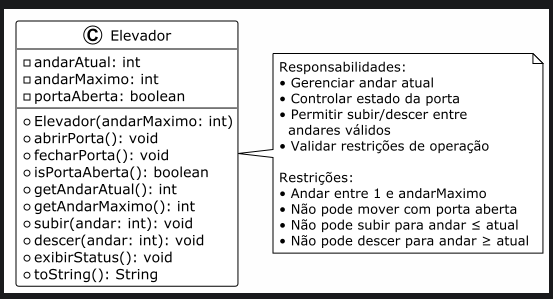

# Atividade - Sistema de Elevador

> Programação Orientada a Objetos - Implementação de um sistema de elevador em Java

## 📋 Descrição do Projeto

Este projeto implementa um sistema de elevador em Java que simula o funcionamento de um elevador real em um edifício. A classe `Elevador` encapsula toda a lógica necessária para gerenciar os movimentos, estado da porta e restrições operacionais.

## ✨ Funcionalidades Implementadas

### Ações Disponíveis
- ⬆️ **Subir**: Move o elevador para um andar superior
- ⬇️ **Descer**: Move o elevador para um andar inferior
- 🚪 **Abrir Porta**: Abre a porta do elevador
- 🚪 **Fechar Porta**: Fecha a porta do elevador
- 📊 **Verificar Status da Porta**: Indica se a porta está aberta ou fechada
- 📍 **Mostrar Andar Atual**: Exibe o andar em que o elevador se encontra

### Restrições Implementadas
- ❌ O elevador **não pode subir** acima do número máximo de andares do edifício
- ❌ O elevador **não pode descer** abaixo do primeiro andar
- ❌ O elevador **não pode se mover** (subir ou descer) com a porta aberta
- ❌ O andar deve ser um número válido (entre 1 e o máximo)

## 👤 Autor

Desenvolvido como atividade de Programação Orientada a Objetos

## 📄 Licença

Este projeto é fornecido como material educacional.